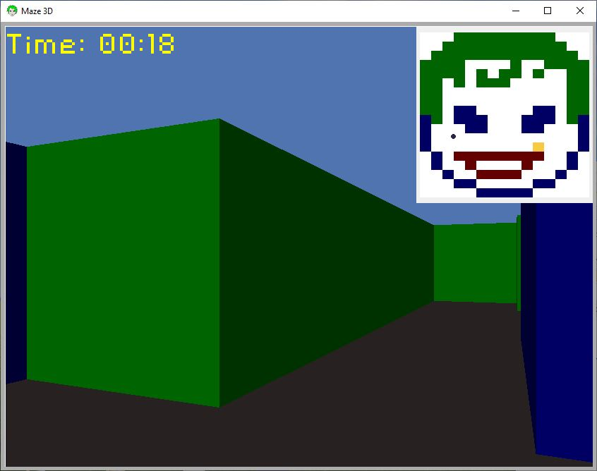

# 3D-Maze
Project made for university course called "Fundamentals of Computer Graphics".

## Contributors:
- [Radosław Leluk](https://github.com/rleluk)
- [Konrad Malski](https://github.com/kmalski)
- [Damian Płóciennik](https://github.com/Vectrom)

## Screenshots from the game

## Credits:
- Music from  [Bensound.com](https://www.bensound.com)
- Joker's face from [FreeVector.com](https://www.freevector.com/free-joker-vector-20260#)
